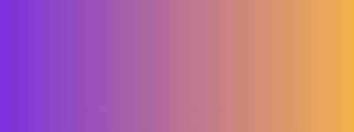

# Gradient maker

App for creating gradient from 2 colors.

## Screenshots


## Usage/Examples

```
User enter: 
#41bbd0, #71db00
```

```
Result: 
background-image: linear-gradient(to right, #41bbd0,#00c6cb,#00d0b6,#00d692,#13db60,#71db00)
```

## Guide

```
Easy steps:

1. Choose gradient orientation (to top, circle, to bottom...)
2. Enter 2 colors and click Generate

Voila! You have nice gradient without “gray dead zone”.
Thanks to the addition of several suitable colors.
```

## Compare results

CSS Gradient created by "Gradient maker"


Simple CSS gradient



## Tech Stack

**Client:**  JavaScript, Vue

**Libraries:** Chroma https://github.com/gka/chroma.js


